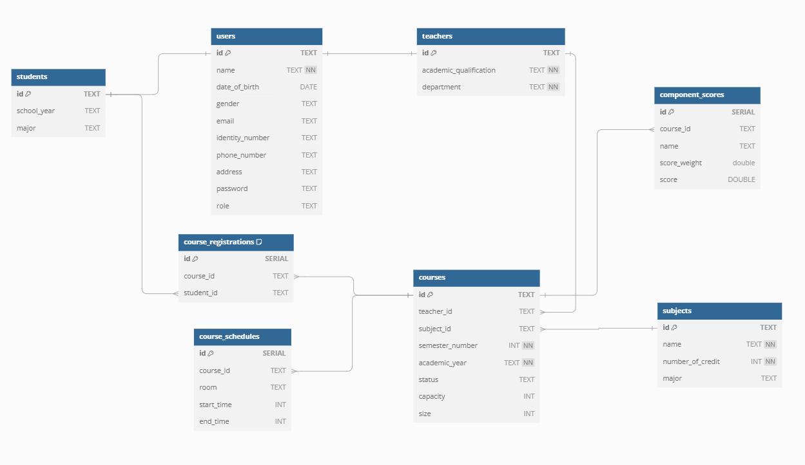

# School Management Project

## Overview

The **School Management Project** is a backend application developed in **Go** using the **Go Kit** framework. It provides functionality to manage **teachers**, **students**, **subjects**, and **courses**. The project utilizes **PostgreSQL** for persistent data storage and **Redis** for caching, ensuring high performance.


## Features

- **Teacher Management**: Manage teacher information.
- **Student Management**: Manage student information.
- **Subject Management**: Manage course information.
- **Course Management**: Manage course, course registrations and schedules.

## Tech Stack

- **Backend**: Go (Go Kit)
- **Database**: PostgreSQL
- **Caching**: Redis

## Database



## Setup and Installation

### Prerequisites

Ensure you have the following installed on your system:

- [Go](https://golang.org/dl/)
- [Docker](https://www.docker.com/products/docker-desktop/)
- [Docker Compose](https://docs.docker.com/compose/install/)

### Steps

1. Clone the repository
2. Build and run the application using Docker Compose:
    ```
    docker compose up -d
    ```
3. The application will be available at `http://localhost:8080`

### Configuration

Update the `docker-compose.yml` file to set environment variables for
- Backend Server:
    - `POSTGRES_HOST`
    - `POSTGRES_PORT`
    - `POSTGRES_USER`
    - `POSTGRES_PASSWORD`
    - `DB_NAME`
    - `REDIS_HOST`
- Postgres
- Redis

### Endpoints
The API provides endpoints for managing:
- Authentication: `/auth`
- Teachers: `/teacher`
- Students: `/student`
- Subjects: `/subjects`
- Courses: `/api/courses`

Refer to [the API documentation](https://documenter.getpostman.com/view/32925493/2sAYBbf9Lz) for detailed endpoint descriptions and usage examples.


